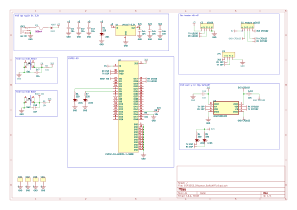
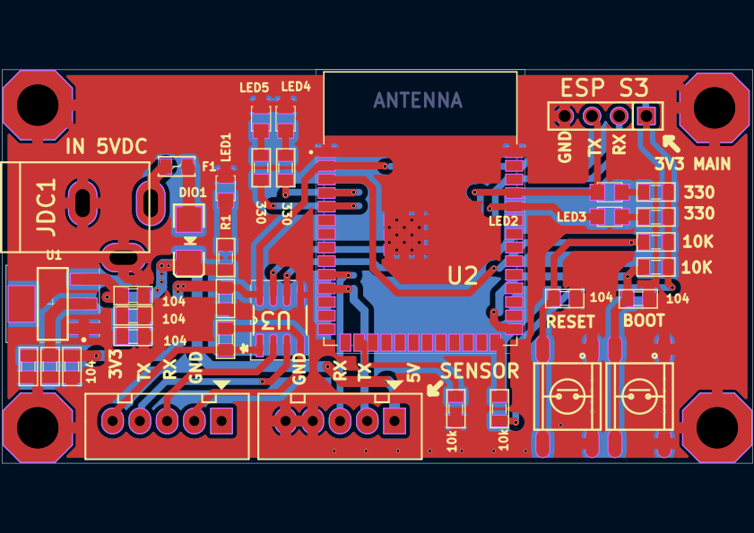

# Dự án ESP32S3_Distance_SoftUART


[](https://www.espressif.com/en/products/socs/esp32-s3)
[](https://learn.microsoft.com/en-us/dotnet/desktop/winforms/)

## Giới thiệu

Đây là đồ án kỹ thuật nâng cao xây dựng một hệ thống đo khoảng cách nhúng dựa trên **ESP32-S3**. Trọng tâm của dự án không nằm ở cảm biến, mà ở việc **tự xây dựng một giao thức UART bằng phần mềm (Software UART / bit-banging)** để truyền dữ liệu từ ESP32-S3 lên PC, thay vì dùng UART phần cứng có sẵn.

ESP32-S3 dùng **UART phần cứng** để giao tiếp với cảm biến siêu âm US-100, đồng thời tự cài đặt một **UART mềm** trên hai chân GPIO thường để giao tiếp với PC thông qua bộ chuyển đổi USB–UART. Dữ liệu khoảng cách và các lệnh phản hồi được đóng gói theo một định dạng khung tự định nghĩa, có kiểm tra lỗi bằng **CRC16 (Modbus)**.

Một ứng dụng **C# WinForms** đóng vai trò giao diện phía PC để hiển thị và trao đổi dữ liệu với ESP32-S3 theo thời gian thực.

## Sơ đồ nguyên lý



Sơ đồ trên thể hiện hai tuyến giao tiếp UART tách biệt trên cùng một MCU:

- **Tuyến UART mềm (màu xanh lá)**: GPIO43/GPIO44 ↔ USB–UART Converter ↔ PC. Đây là tuyến do nhóm tự lập trình bit-banging.
- **Tuyến UART cứng (màu xanh dương)**: GPIO17/GPIO18 ↔ US-100. Dùng peripheral UART có sẵn của ESP32-S3.

## Sơ đồ mạch in (PCB) minh họa



Bản phác thảo bố trí mạch trên chỉ nhằm trực quan hoá cách đấu nối giữa module ESP32-S3, đầu nối J1 (US-100) và đầu nối J2 (USB–UART converter); đây **không phải file Gerber để sản xuất thực tế**, mà là gợi ý bố trí nếu muốn chuyển từ đấu dây rời sang một board mạch cố định.

## Thành phần phần cứng

| Thành phần                | Số lượng | Vai trò                                                           |
| -------------------------- | -------- | ------------------------------------------------------------------ |
| ESP32-S3                   | 1        | MCU trung tâm, chạy firmware và UART mềm                          |
| Cảm biến siêu âm US-100     | 1        | Đo khoảng cách, giao tiếp với ESP32-S3 qua UART phần cứng          |
| Bộ chuyển đổi USB–UART      | 1        | Cầu nối giữa UART mềm của ESP32-S3 và cổng USB của PC              |
| PC / Laptop                | 1        | Chạy ứng dụng WinForms để giám sát và giao tiếp                    |

## Cấu hình chân

### US-100 – ESP32-S3 (UART phần cứng)

| Chân ESP32-S3 | Chức năng | Chân US-100 | Ghi chú                                  |
| -------------- | --------- | ----------- | ------------------------------------------ |
| **GPIO17**     | UART RX   | **TX**      | ESP32-S3 nhận dữ liệu khoảng cách từ US-100 |
| **GPIO18**     | UART TX   | **RX**      | ESP32-S3 gửi lệnh đo tới US-100             |
| **GND**        | Mass      | **GND**     | **Bắt buộc phải nối chung**                 |
| **5V / VCC**   | Nguồn     | **VCC**     | Cấp theo đúng thông số của module US-100    |

### UART mềm – PC

| Chân ESP32-S3 | Chức năng          | USB–UART Converter | Mục đích                          |
| -------------- | ------------------- | ------------------- | ----------------------------------- |
| **GPIO43**     | Software UART TX    | **RX**              | ESP32-S3 gửi dữ liệu khoảng cách lên PC |
| **GPIO44**     | Software UART RX    | **TX**              | ESP32-S3 nhận lệnh từ PC             |
| **GND**        | Mass                 | **GND**             | **Bắt buộc phải nối chung**          |

## Software UART tự xây dựng — phần trọng tâm của dự án

Vì ESP32-S3 chỉ có một số ít cổng UART phần cứng và một cổng đã dành cho US-100, nhóm tự cài đặt một **UART mềm (bit-banging)** trên GPIO43/GPIO44 để có thêm một kênh truyền độc lập tới PC, đồng thời hiểu rõ nguyên lý hoạt động ở mức bit của giao tiếp UART thay vì chỉ dùng thư viện có sẵn.

### 1. Nguyên lý bit-banging

UART mềm không dùng bộ ngoại vi UART chuyên dụng của chip, mà điều khiển trực tiếp mức điện áp (HIGH/LOW) trên một chân GPIO thường theo đúng thời gian của từng bit, do phần mềm tự tạo:

- **TX (phát)**: chân GPIO được cấu hình là output, lần lượt kéo mức điện áp lên/xuống theo từng bit của khung dữ liệu, mỗi bit giữ đúng trong một khoảng thời gian cố định gọi là *bit time*.
- **RX (thu)**: chân GPIO được cấu hình là input, liên tục lấy mẫu mức điện áp tại giữa mỗi *bit time* để xác định bit đó là 0 hay 1, bắt đầu từ cạnh xuống của **start bit**.

### 2. Thông số khung truyền

- Tốc độ baud: **9600 bps**
- Định dạng: **8N1** — 8 bit dữ liệu, không bit chẵn lẻ, 1 bit dừng
- *Bit time* = 1 / 9600 ≈ 104 µs — đây là khoảng thời gian mà cả hai chiều TX/RX phải bám sát để không bị lệch mẫu (sai số timing là nguyên nhân lỗi phổ biến nhất của UART mềm).

### 3. Quy trình phát (TX) do phần mềm điều khiển

1. Kéo chân xuống mức LOW trong đúng một *bit time* để tạo **start bit**.
2. Lần lượt xuất từng bit dữ liệu (thường theo thứ tự LSB trước), mỗi bit giữ đúng một *bit time*.
3. Kéo chân lên mức HIGH trong một *bit time* để tạo **stop bit**, đưa đường truyền về trạng thái nghỉ (idle).
4. Toàn bộ tiến trình phải chạy với độ trễ được canh chính xác (busy-wait hoặc timer), tránh bị các tác vụ khác của firmware làm gián đoạn giữa chừng.

### 4. Quy trình thu (RX) do phần mềm điều khiển

1. Liên tục theo dõi chân GPIO ở trạng thái idle (mức HIGH); khi phát hiện cạnh xuống, xác định đó là **start bit**.
2. Chờ nửa *bit time* để lấy mẫu vào đúng giữa start bit (xác nhận không phải nhiễu), sau đó lấy mẫu tiếp mỗi *bit time* cho 8 bit dữ liệu.
3. Ghép các bit đã lấy mẫu thành một byte hoàn chỉnh.
4. Kiểm tra **stop bit**; nếu không đúng mức HIGH như kỳ vọng, byte được xem là lỗi khung (frame error).

### 5. Định dạng gói tin và CRC16

Sau khi lớp UART mềm truyền/nhận được các byte thô, firmware đóng gói dữ liệu khoảng cách theo khung tự định nghĩa:

```
@DATA:CRC&
```

- `DATA`: giá trị khoảng cách đo được.
- `CRC`: mã kiểm tra **CRC16 (Modbus)** tính trên phần `DATA`, giúp bên nhận phát hiện lỗi truyền do nhiễu hoặc lệch timing của UART mềm.
- Bên nhận tính lại CRC16 trên dữ liệu nhận được và so sánh với CRC đi kèm; nếu không khớp, phản hồi `CRC_FAIL` để yêu cầu gửi lại thay vì chấp nhận dữ liệu sai.

### 6. UART mềm so với UART phần cứng trong dự án

| Tiêu chí            | UART phần cứng (US-100)          | UART mềm tự xây dựng (PC)                  |
| --------------------- | ---------------------------------- | --------------------------------------------- |
| Bộ điều khiển         | Peripheral UART tích hợp trong chip | Vòng lặp phần mềm điều khiển GPIO thường     |
| Độ chính xác timing   | Do phần cứng đảm bảo               | Phụ thuộc vào việc canh delay/timer chính xác |
| Chi phí CPU           | Thấp                                | Cao hơn do phải bận (busy-wait) trong lúc truyền/nhận |
| Mục đích trong đồ án  | Đọc cảm biến ổn định               | Minh hoạ và thực hành nguyên lý UART ở mức bit |

## Kiến trúc hệ thống tổng quan

```text
┌─────────────────────┐
│   Ứng dụng WinForms  │
│   (giám sát trên PC) │
└──────────┬──────────┘
           │ Software UART (bit-banging)
           │ khung: @DATA:CRC&
           ▼
┌─────────────────────┐
│      ESP32-S3       │
│ ┌─────────────────┐ │
│ │ Software UART   │ │
│ │  + CRC16        │ │
│ └────────┬────────┘ │
│          │          │
│ ┌────────▼────────┐ │
│ │ UART phần cứng  │ │
│ └────────┬────────┘ │
└──────────┼──────────┘
           │ UART
           ▼
┌─────────────────────┐
│       US-100        │
│  Cảm biến siêu âm    │
└─────────────────────┘
```

### Quy trình hoạt động

1. **Khởi tạo**: cấu hình UART phần cứng cho US-100 và cấu hình UART mềm (GPIO43/44) cho PC.
2. **Đo khoảng cách**: gửi lệnh `0x55` tới US-100, đọc và xác thực 2 byte khoảng cách trả về.
3. **Đóng gói và truyền**: tính CRC16 (Modbus), gửi lên PC qua UART mềm theo khung `@DATA:CRC&`.
4. **Giao tiếp với PC**: nhận và phân tích lệnh từ WinForms, xác thực CRC nhận được, trả về dữ liệu hoặc `CRC_FAIL`.
5. **Vận hành liên tục**: đo định kỳ đồng thời xử lý giao tiếp UART mềm với PC song song.

## Bắt đầu

### Yêu cầu phần mềm

| Phần mềm                   | Phiên bản | Mục đích                                       |
| ---------------------------- | ---------- | ------------------------------------------------- |
| Arduino IDE / PlatformIO      | Mới nhất   | Phát triển và nạp firmware cho ESP32-S3          |
| ESP32 Arduino Core             | Mới nhất   | Hỗ trợ phần cứng và ngoại vi ESP32-S3             |
| C# / .NET WinForms             | .NET 6+    | Ứng dụng giám sát và giao tiếp phía PC             |
| Serial Terminal                | Bất kỳ     | Kiểm thử và gỡ lỗi giao tiếp nối tiếp              |

### Lắp phần cứng

* Nối US-100 vào GPIO17 (RX) và GPIO18 (TX) — dùng UART phần cứng.
* Nối bộ chuyển đổi USB–UART vào GPIO43 (TX) và GPIO44 (RX) — dùng UART mềm.
* Đảm bảo ESP32-S3, US-100 và bộ chuyển đổi USB–UART dùng chung **GND**.
* Đảm bảo mức điện áp logic của bộ chuyển đổi USB–UART tương thích với ESP32-S3.

### Cài đặt

1. Sao chép kho mã nguồn:

```bash
git clone <repository-url>
cd ESP32S3_Distance_SoftUART
```

2. Mở dự án trong **Arduino IDE hoặc PlatformIO**.
3. Chọn đúng board **ESP32-S3** và cổng serial tương ứng.
4. Kết nối US-100 và bộ chuyển đổi USB–UART theo đúng bảng cấu hình chân.
5. Biên dịch và nạp firmware cho ESP32-S3.
6. Mở ứng dụng WinForms và chọn cổng serial tương ứng.
7. Khởi động hệ thống — ESP32-S3 sẽ đo khoảng cách định kỳ từ US-100 và gửi kết quả lên PC theo khung `@DATA:CRC&` qua UART mềm.

### Kiểm thử giao tiếp

Có thể dùng serial terminal hoặc ứng dụng WinForms để gửi một khung hợp lệ tới ESP32-S3 và kiểm tra xem CRC có được xác thực đúng và phản hồi trả về có như mong đợi hay không.

## Tài liệu tham khảo

* [Datasheet ESP32-S3](https://www.espressif.com/sites/default/files/documentation/esp32-s3_datasheet_en.pdf)
* [Tài liệu tham chiếu kỹ thuật ESP32-S3](https://www.espressif.com/sites/default/files/documentation/esp32-s3_technical_reference_manual_en.pdf)
* [Tài liệu Arduino-ESP32](https://docs.espressif.com/projects/arduino-esp32/en/latest/)
* [Datasheet cảm biến siêu âm US-100](https://www.mouser.com/datasheet/2/813/US-100-DS-1218130.pdf)
* [Tài liệu Microsoft .NET](https://learn.microsoft.com/en-us/dotnet/)
* [Tài liệu Windows Forms](https://learn.microsoft.com/en-us/dotnet/desktop/winforms/)
* [Modbus CRC16](https://www.modbustools.com/modbus_crc16.htm)

## Trạng thái dự án

* **Trạng thái**: Hoàn thành
* **Phiên bản**: v1.0
* **Cập nhật lần cuối**: Tháng 9/2026

## Liên hệ

**Gia Bảo**
📧 Email: *[your-email@example.com](mailto:your-email@example.com)*
🐙 GitHub: *your-github-profile*
